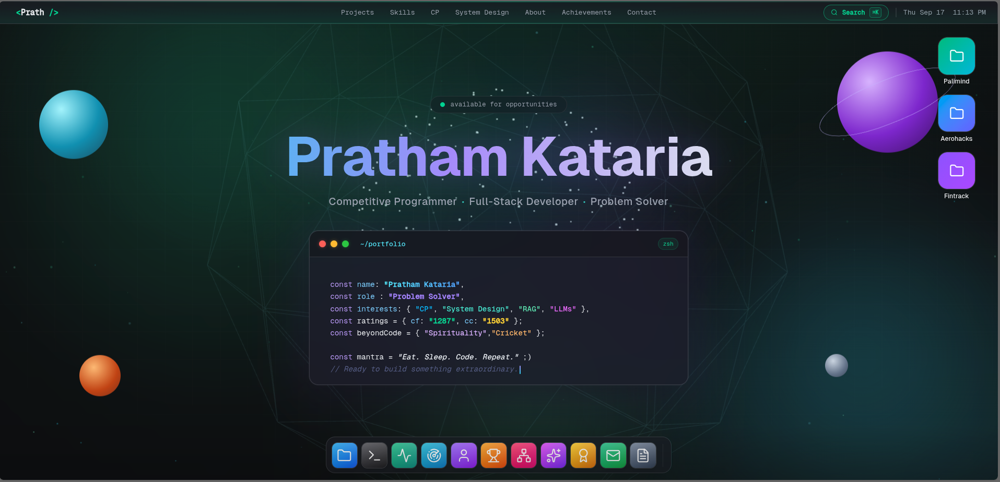

# Portfolio - macOS Edition 🎨

[](https://prathamkataria.vercel.app/)

Welcome to my portfolio! This project is a creative and interactive personal portfolio designed to mimic the aesthetic and functionality of Apple's macOS desktop. It moves beyond traditional portfolio layouts to offer a unique, engaging user experience where my projects, skills, and contact information are presented as applications and files within a simulated operating system.



## ✨ Core Features

- **macOS-Inspired UI**: A familiar and intuitive desktop interface, complete with a boot screen, menu bar, dock, desktop icons, and draggable/resizable windows.
- **Dynamic Window Management**: Open multiple "apps" at once, bring them to the front, minimize, or close them. The z-index and state of each window are managed globally via Zustand.
- **Functional Dock**: A sleek dock with a smooth magnification effect, providing quick access to all portfolio sections.
- **Realistic "Apps"**:
  - **Finder**: Browse featured projects, each presented as a folder with an overview, repository link, live demo, and tech stack info.
  - **Terminal**: An interactive command-line experience to explore the portfolio.
  - **Activity Monitor**: Live competitive programming stats (Codeforces, CodeChef, LeetCode) rendered with charts.
  - **Skills**: Technical skills and proficiency, visualized as a radar chart.
  - **About Me**: Personal introduction, education, and experience.
  - **Competitive Programming**: Platform-wise ratings and achievements.
  - **System Design**: Notable system design work and concepts.
  - **AI Projects**: AI-powered projects and experiments.
  - **Achievements**: Hackathon and competitive programming milestones.
  - **Contact**: Social links and ways to get in touch.
  - **Resume**: An embedded PDF viewer for the full resume.
- **Spotlight Search**: A Cmd/Ctrl+K launcher to quickly open any app.
- **Context Menu**: Right-click anywhere for macOS-style actions.
- **Live 3D Background**: An animated Three.js background (aurora, particles, and scene variants).
- **Dark & Light Mode**: Switch between themes seamlessly.
- **Live Stats**: Codeforces, CodeChef, LeetCode, and GitHub stats fetched automatically via `scripts/refresh-stats.mjs` into `public/data/stats.json`.
- **Fully Responsive**: While designed for a desktop experience, the layout adapts to smaller screen sizes.

## 🛠 Tech Stack

This portfolio is built with a modern, powerful stack to ensure a smooth and performant experience:

- **Framework**: [React 19](https://react.dev/)
- **Build Tool**: [Vite](https://vitejs.dev/)
- **Styling**: [Tailwind CSS v4](https://tailwindcss.com/)
- **State Management**: [Zustand](https://github.com/pmndrs/zustand) (simple, scalable global state)
- **3D Background**: [Three.js](https://threejs.org/) + [React Three Fiber](https://docs.pmnd.rs/react-three-fiber) + [Drei](https://github.com/pmndrs/drei)
- **Animations**: [GSAP](https://greensock.com/gsap/) and [Framer Motion](https://www.framer.com/motion/)
- **Charts**: [Recharts](https://recharts.org/)
- **PDF Viewing**: [React-PDF](https://github.com/wojtekmaj/react-pdf)
- **Icons**: [Lucide React](https://lucide.dev/)

## 📂 Project Structure

The codebase is organized to be modular and easy to navigate:

```
prathfolio/
├── public/
│   ├── data/            # Live stats JSON (generated by scripts/refresh-stats.mjs)
│   ├── files/           # Resume PDF
│   ├── icons/           # App and file icons
│   └── images/          # Static images and wallpapers
├── scripts/
│   └── refresh-stats.mjs # Fetches Codeforces/CodeChef/LeetCode/GitHub stats
├── src/
│   ├── components/      # Core UI (BootScreen, Dock, MenuBar, Spotlight, ContextMenu, DesktopFolders)
│   │   └── Background/  # Three.js background (Aurora, Particles, Scene)
│   ├── constants/       # Centralized data (apps, content, stats, UI)
│   ├── lib/             # Helpers (stats parsing, preload utilities)
│   ├── store/           # Zustand stores (boot, window, context menu, search)
│   ├── windows/         # One component per "app" window (Finder, Terminal, Skills, …)
│   │   └── terminal/    # Terminal command definitions
│   ├── App.jsx          # Main application component, orchestrates layout and windows
│   ├── index.css        # Global styles
│   └── main.jsx         # Entry point for the React application
├── vite.config.js       # Vite configuration
├── package.json         # Project dependencies and scripts
└── README.md            # You are here!
```

### Key Highlights of the Structure

- **`src/constants/`**: The heart of the portfolio's content — no component changes needed to edit data.
  - `content.js`: Personal info, roles, social links, and hero copy.
  - `apps.js`: Dock apps, default window sizes, and z-index settings.
  - `stats.js`: Fallback stats used before live data is fetched.
  - `ui.js`: Shared UI constants.
- **`src/store/`**: Zustand stores for global state.
  - `window.js`: Tracks each window's state (open? minimized? z-index?).
  - `boot.js`: Boot screen state.
  - `context.js`: Right-click context menu state.
  - `search.js`: Spotlight search state.
- **`src/windows/`**: Each "application" is its own component, making it easy to add new windows or restyle existing ones.

## 🚀 Getting Started

To run this project on your local machine, follow these steps:

1.  **Clone the Repository**

    ```sh
    git clone https://github.com/Pratham21223/Portfolio.git
    cd Portfolio
    ```

2.  **Install Dependencies**

    ```sh
    npm install
    ```

3.  **Run the Development Server**

    ```sh
    npm run dev
    ```

    The application will be available at `http://localhost:5173` (or another port if 5173 is in use).

4.  **(Optional) Refresh Live Stats**

    ```sh
    node scripts/refresh-stats.mjs
    ```

    This fetches the latest Codeforces, CodeChef, LeetCode, and GitHub stats and writes them to `public/data/stats.json`. The app falls back to the values in `src/constants/stats.js` when this file is missing.

## 💡 How to Customize

Customizing the portfolio with your own information is straightforward:

1.  **Update Personal Info**: Edit the `profile`, `roles`, and `heroCopy` objects in `src/constants/content.js`.
2.  **Edit Socials**: Modify the `socials` array in `src/constants/content.js` with your own links.
3.  **Edit Dock Apps**: Update the `dockApps` array in `src/constants/apps.js`.
4.  **Edit App Content**: Open the corresponding file in `src/windows/` (e.g., `Project.jsx` for featured projects, `Skills.jsx` for the tech stack).
5.  **Edit Competitive Stats**: Update the handles in `scripts/refresh-stats.mjs`, then run `node scripts/refresh-stats.mjs`.
6.  **Replace Resume**: Replace the PDF in `public/files/` with your own.
7.  **Change Images**: Swap out images in `public/images/` and `public/icons/` to match your personal brand.

---

Feel free to fork this project, give it a star ⭐, and customize it to make it your own!
